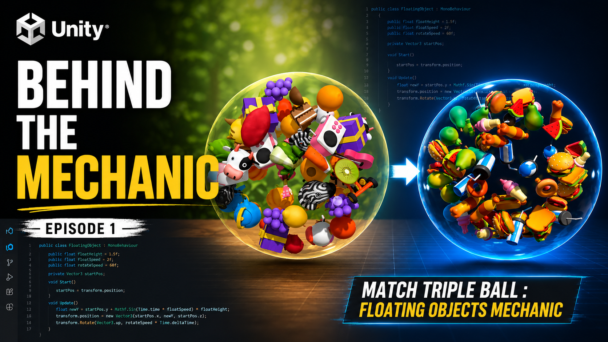

# Behind the Mechanic - Episode 1

## Match Triple Ball: Floating Objects Mechanic

This repository contains the scripts used in the tutorial.

Unity Version
- Unity 6000.3.7f1

Render Pipeline
- URP

Assets Used
- Food FREE - Low Poly 3D Models Pack - https://assetstore.unity.com/packages/3d/props/food/food-free-low-poly-3d-models-pack-260726

Packages Used
- DOTween

### Youtube video link

